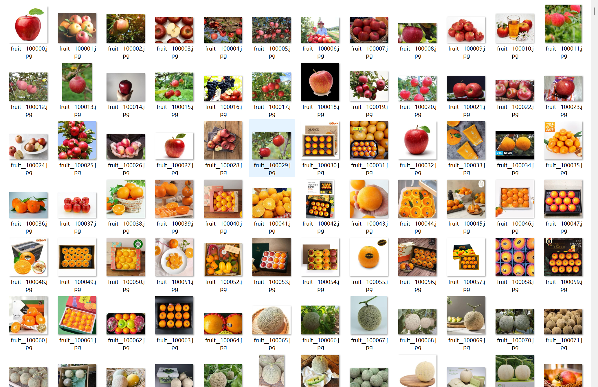
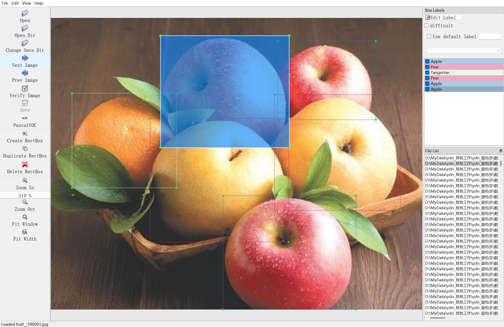
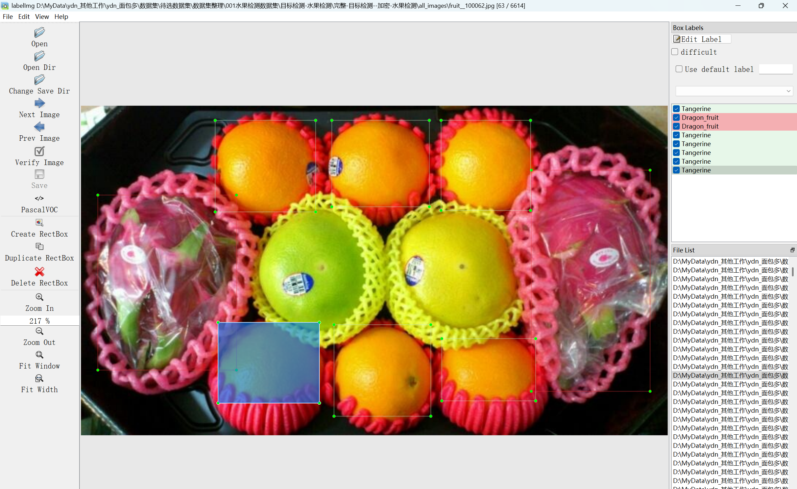
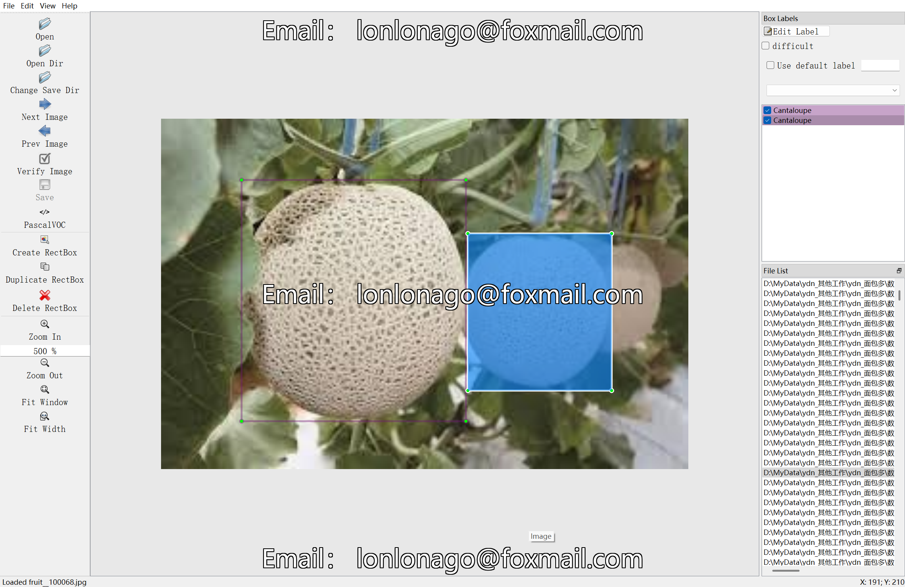

# 12 Fruits Identification - Target Detection Dataset

Dataset Information Introduction: A total of 6614 images and correspondingly labeled files are included.
The labeled files come in two formats: VOC formatted xml files and YOLO formatted txt files.
The objects to be identified include the following:
['Apple', 'Blueberry', 'Cantaloupe', 'Dragon fruit', 'Durian', 'Grape', 'Korean melon', 'Lemon', 'Pear', 'Pineapple', 'Tangerine', 'Watermelon']
The number of bounding box information is as follows: (When labeling, usually the English labels are used, and the Chinese names inside parentheses provide a reference)
Note: An image may contain multiple objects, so the total number of bounding boxes may be greater than the number of images.
The complete dataset consists of three folders and one txt file:
all_images file: Stores the dataset's images, screenshots below:
all_txt folder and classes.txt: Stores the YOLO formatted txt labeled files, with the same number as the images, each labeled file corresponds to an image.
To view the detailed standard file of the YOLO format, please search for it yourself on Baidu. In short, the object numbered 0 in the index represents the name at the position 0 in the array listed in classes.txt.
all_xml file: The VOC formatted xml labeled files.
The number is the same as the images, each labeled file corresponds to an image.
To view the detailed standard file of the VOC format, please search for it yourself on Baidu.
Both formats can be used, choose one based on your preference.
Labeling effect screenshot:

## Images

Here is a pay link on Stripe ( https://buy.stripe.com/3cs8yP7sY87d0vu9AB ). Please contact me lonlonago@foxmail.com after funding $89, and I will send you a complete data files , thank you!

